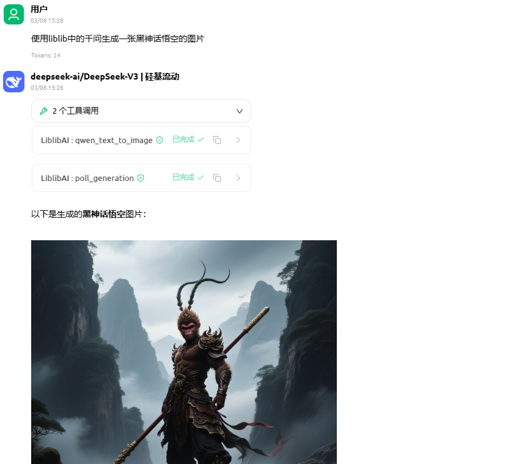

# LiblibAI MCP Server

一个基于 Python 的 LiblibAI MCP 服务端，使用 Streamable HTTP 传输协议，适合接入支持远程 MCP 的客户端工具。



## 功能

- 支持 LiblibAI 官方签名鉴权
- 支持本地图片、视频自动上传到 Liblib 可访问地址
- 支持图片生成、图片编辑、局部重绘、视频生成等常见能力
- 支持异步任务查询与轮询
- 支持生成结果自动下载到本地目录
- 即使文件已下载到本地，仍保留线上 URL，方便继续传给其他工具

## 已提供的 MCP Tools

- `server_info`
- `upload_file`
- `submit_generation`
- `star3_text_to_image`
- `star3_image_to_image`
- `qwen_text_to_image`
- `kontext_text_to_image`
- `kontext_image_to_image`
- `img1_generate`
- `img1_inpaint`
- `libdream_text_to_image`
- `libedit_image_edit`
- `kling_text_to_video`
- `kling_image_to_video`
- `kling_multi_image_to_video`
- `kling_omni_video`
- `get_generation_status`
- `poll_generation`

## 运行要求

- Python 3.11+
- Docker
- Docker Compose
- 可用的 LiblibAI `AccessKey` 和 `SecretKey`

## 快速开始

### 一、手动启动

#### 1. 安装依赖

```bash
pip install -r requirements.txt
```

#### 2. 设置环境变量

Linux / macOS：

```
export PYTHONPATH=./src export LIBLIB_ACCESS_KEY=你的AccessKey export LIBLIB_SECRET_KEY=你的SecretKey 
```

Windows PowerShell：

```
$env:PYTHONPATH = ".\\src" $env:LIBLIB_ACCESS_KEY = "你的AccessKey" $env:LIBLIB_SECRET_KEY = "你的SecretKey" 
```

#### 3. 启动服务

```
python -m liblib_mcp.server 
```

#### 4. 导入 MCP

```
http://127.0.0.1:8000/mcp 
```

健康检查：

```
http://127.0.0.1:8000/healthz 
```

------

### 二、Docker 部署

#### 方式 1：命令启动

##### 1. 构建镜像

```
docker build -t liblibai-mcp-server . 
```

##### 2. 启动容器

Linux / macOS：

```
docker run --rm \
-p 18081:8000 \
-e LIBLIB_ACCESS_KEY=你的AccessKey \
-e LIBLIB_SECRET_KEY=你的SecretKey \
-v $(pwd)/output:/data/output \
liblibai-mcp-server 
```

Windows PowerShell：

```
docker run --rm `  -p 18081:8000 `  -e LIBLIB_ACCESS_KEY=你的AccessKey `  -e LIBLIB_SECRET_KEY=你的SecretKey `  -v ${PWD}\output:/data/output `  liblibai-mcp-server 
```

##### 3. 导入 MCP

```
http://IP:18081/mcp 
```

健康检查：

```
http://IP:18081/healthz 
```

------

#### 方式 2：通过 docker-compose.yml 启动

##### 1. 修改 docker-compose.yml

把下面两个字段替换成你自己的密钥：

- LIBLIB_ACCESS_KEY
- LIBLIB_SECRET_KEY

默认文件中已经留了提示文本：

```
LIBLIB_ACCESS_KEY: "REPLACE_LIBLIB_ACCESS_KEY"//请替换为你的AccessKey
LIBLIB_SECRET_KEY: "REPLACE_LIBLIB_SECRET_KEY"//请替换为你的SecretKey
```

##### 2. 启动服务

源码编译镜像

```
docker compose up -d --build 
```

云端拉取镜像

```
docker run galaxy5321755/liblibai-mcp-server
```

##### 3. 导入 MCP

```
http://IP:18081/mcp 
```

健康检查：

```
http://IP:18081/healthz 
```

##### 4. 停止服务

```
docker compose down 
```

## 数据目录

容器内生成文件目录：

```
/data/output 
```

docker-compose.yml 和 docker run 都会把它映射到宿主机目录：

```
./output 
```

生成成功后，通常会看到类似结构：

```
output/  <generate_uuid>/    images/    videos/    covers/ 
```

## 使用方式

### 图片生成

常见工具：

- star3_text_to_image
- qwen_text_to_image
- libdream_text_to_image
- img1_generate

### 图片编辑

常见工具：

- star3_image_to_image
- kontext_image_to_image
- libedit_image_edit
- img1_inpaint

### 视频生成

常见工具：

- kling_text_to_video
- kling_image_to_video
- kling_multi_image_to_video
- kling_omni_video

### 通用透传

当专用工具不够用时，使用：

- submit_generation

## 本地文件输入

以下场景可以直接传本地文件路径，服务端会自动先上传到 Liblib，再把请求里的对应字段替换成线上 URL：

- 原图
- 蒙版图
- 控制图
- 参考图
- 首帧图
- 尾帧图
- 参考视频

这样可以避免手动先上传文件。

## 任务结果

生成任务通常是异步的，推荐流程：

1. 调用生成工具提交任务
2. 拿到 generate_uuid
3. 用 poll_generation 等待完成
4. 或用 get_generation_status 查询单次状态

结果中会同时保留：

- 远程 URL
- 本地下载路径

例如图片结果：

- remote_url
- local_path

例如视频结果：

- remote_url
- local_path
- cover_url
- cover_local_path

## 默认参数策略

为了提升使用体验，大多数“专业参数”默认都是可选的。用户不传时，服务端会使用预设默认值。

例如：

- Star-3 默认 img_count=1、steps=30
- Qwen Image 默认 clip_skip=2、sampler=1、steps=30、cfg_scale=4.0
- Kling 默认 aspect_ratio=16:9、duration=5
- 轮询默认每 5 秒一次，超时 900 秒

## 说明

这个仓库提供的是已经封装好的 LiblibAI MCP 服务端。

如果你只想使用，不需要了解内部实现，重点关注：

- 手动启动方式
- docker run 启动方式
- docker-compose.yml 启动方式
- MCP 地址
- 输出目录
